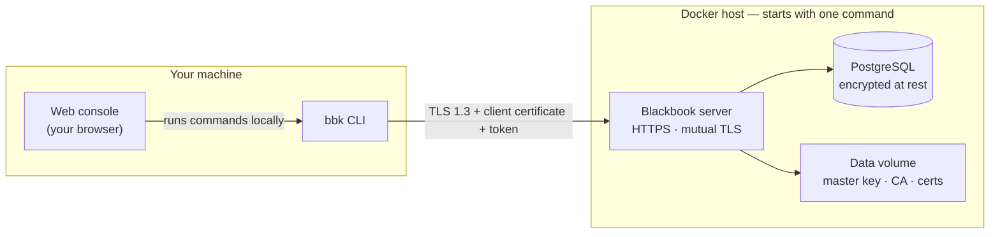
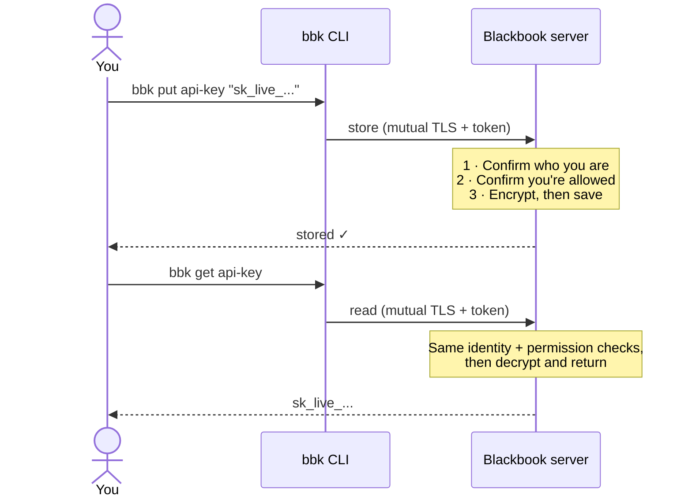
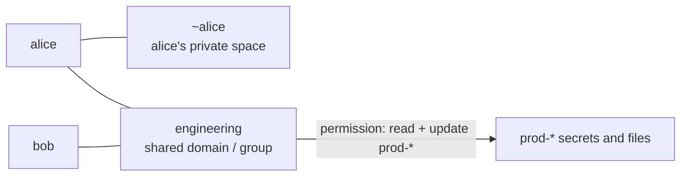

# Blackbook Secrets Engine


The utmost in paranoid security. Highest-security defaults, layers of encryption, rich ACLs, a tamper-evident audit log, all served over mTLS. Stores secrets as strings or file objects. Open source for security's sake, with in-depth documentation on the internal workings. Deploys as a Docker container and can be driven from a pure CLI or a local web console.

---

## What is Blackbook?

Blackbook is a **secrets manager**: a private, encrypted place to keep the sensitive strings and files your systems depend on — API keys, database passwords, tokens, certificates, small credential files — so they aren't scattered across `.env` files, chat messages, and sticky notes.

You run it as a **Docker container** on a machine you control, and you talk to it from a small command-line tool called `bbk` (or a local web page that runs the same commands for you).

```bash
bbk put api-key "sk_live_abc123"     # save a secret
bbk get api-key                       # read it back
bbk file put ./id_rsa --name ssh-key  # save a file
```

That's the whole idea. Everything below is about *how hard Blackbook works to keep those secrets safe* — mostly without you having to think about it.

---

## You don't have to be a security expert

Most tools make you *opt in* to safety: turn on encryption, enable two-factor, configure TLS, set permissions. It's easy to forget a step, and one forgotten step is often the whole breach.

**Blackbook flips that around. The strongest option is simply the default.** There's usually no "secure mode" to switch on, because there's no insecure mode to begin with. Out of the box, with zero configuration:

| You get this, automatically | In plain terms |
|---|---|
| **Encrypted in transit (TLS 1.3)** | Nobody on the network can read what you send or receive. There is no unencrypted way to connect. |
| **Two credentials required for every request** | Every command must prove itself with *both* a certificate *and* a token. A stolen token alone — or a copied certificate alone — is useless. |
| **Encrypted at rest** | Secrets and files are encrypted before they're written to disk. A stolen copy of the database is just noise. |
| **Even the *names* are hidden** | The database doesn't just hide your secret *values* — it also encrypts the *names* of your secrets, files, users, and groups. An attacker with full database access can't even tell what you're storing. |
| **Read-only by default** | Saving a secret a second time is refused, so you can't silently clobber something important. Overwriting is a deliberate, separate action. |
| **Every action is logged, tamper-evidently** | Each entry is cryptographically chained to the one before it, so nobody can quietly delete or edit history. |
| **Your saved login is itself encrypted** | The credentials stored on *your* machine are sealed under a passphrase. A stolen laptop folder is inert without it. |
| **Abuse-resistant** | A single client flooding the server gets throttled, so one bad actor can't take the service down for everyone. |

You *can* turn the dial up even further when a particular secret deserves it — require a fresh two-factor code on every read, demand approval from your teammates, make it self-destruct after one read, or encrypt it so that **even the server operator can't read it**. Those are covered later. But you never have to reach for them just to be safe. Safe is the floor.

---

## How it fits together

At a high level there are only a few moving parts: **you** (using the CLI or the web console), the **Blackbook server** running in Docker, and its **PostgreSQL database** — everything encrypted and authenticated between them.



- **The CLI** is how you (or your scripts) actually use Blackbook.
- **The web console** is an optional local page that simply *runs the CLI for you* — same commands, nicer buttons.
- **The server** enforces every rule and does all the encryption. It's the only thing that ever holds the master key (in memory).
- **PostgreSQL** stores the encrypted data. The **data volume** holds the keys and certificates. Both live on the Docker host you control.

Storing and reading a secret always passes through the same gates, so you get the same protection every time:



---

## Quick start

You need **Docker** (with Compose) and, to build the CLI, **Rust** (`cargo`). On Windows, building the CLI also needs `perl` (for the bundled OpenSSL).

```powershell
# 1. One-time: create the master keyfile. This single 32-byte file is what
#    ultimately protects everything. It is mounted as a Docker secret and kept
#    OFF the data volume, so a copy of the volume alone can't decrypt anything.
#    Back it up somewhere safe and separate — if you lose it, the data is gone.
mkdir secrets; openssl rand 32 > secrets/master_keyfile

# 2. One-time: generate the TLS certificates for the server-to-database link.
./scripts/generate-postgres-certs.sh

# 3. One-time: set your database passwords (change every value in the file).
cp .env.example .env    # then edit .env

# 4. Start it up.
docker compose up -d

# 5. Grab your admin login. On first start the server writes a complete
#    "bundle" (server address + token + certificate + key + CA) to the volume.
#    This file is the ONLY place the admin token ever appears — it is never logged.
docker cp blackbook-app:/opt/blackbook/data/admin-bundle.json .

# 6. Build and install the CLI on your machine.
cargo install --path .

# 7. Log in from the bundle. You'll be asked for a passphrase — this encrypts
#    the login that gets saved on your machine (nothing is stored in the clear).
bbk login admin-bundle.json
```

You're ready:

```powershell
bbk put api-key sk_live_super_secret   # save a secret
bbk get api-key                         # read it back
bbk ls                                  # list what you have
```

> **A note on the `login` passphrase.** Blackbook encrypts your saved credentials on *your* disk, so it asks for a passphrase to seal them. So you're not prompted on every command, `bbk unlock` caches the derived key for a while (default 15 minutes); `bbk lock` clears it. For scripts, set `$BLACKBOOK_PASSPHRASE`.

---

## Core concepts, in plain language

Four ideas cover almost everything you'll do.

### 1. Secrets and files

A **secret** is a short string (a key, a password, a token). A **file** is any file up to 64 MiB (a certificate, a keystore, a config blob). They behave the same way and support the same protections — you just use `put`/`get` for secrets and `file put`/`file get` for files.

```powershell
bbk put db-password "hunter2"
bbk file put ./service-account.json --name gcp-sa
```

### 2. Identities (profiles)

Each person or app that uses Blackbook is a **client** with its own identity. On your machine, a saved, encrypted login is called a **profile** (stored under `~/.bbk`). You can hold several at once and pick one per command with `-P`:

```powershell
bbk -P alice get api-key      # act as alice
bbk -P bob   get api-key      # act as bob, same shell
bbk profile ls                # '*' marks your default
```

An admin provisions a new client and hands them a bundle to log in with:

```powershell
bbk client create alice --out alice.json   # admin does this
bbk login alice.json                        # alice does this
```

### 3. Domains (your private space + shared spaces)

A **domain** is a named space that is *both* a folder and a group. Two ideas, one word:

- The **same name** (say, `api-key`) can live in different domains without colliding.
- Granting permission to a domain (written `@engineering`) grants it to **every member** of that domain.

Every client automatically gets a **private domain of its own**, named `~yourname`, that only they administer — no admin has to set anything up. When you log in, that private space becomes your default, so `bbk put api-key ...` just works and lands somewhere only you can reach.

```powershell
bbk whoami                    # shows e.g. "user domain: ~alice"
bbk put api-key sk_xxx        # lands in ~alice, no setup needed
bbk -D engineering get k      # reach into a shared domain when you need to
```

### 4. Permissions (ACLs)

By default you can reach your own private domain and nothing else. To share, an admin (or a domain admin) grants a **permission rule**: a subject, a name pattern, and which actions are allowed.

```powershell
# Everyone in @engineering may read and update anything named prod-*
bbk acl grant "@engineering" "prod-*" --read --update --domain engineering

# Give alice read access to one path, but only 5 times and only until year-end
bbk acl grant alice "rotated-keys/*" --read --max-uses 5 --expires-at 2026-12-31T00:00:00Z
```

Rules can be scoped to a single client or a whole group, limited to a time window (`--not-before` / `--expires-at`), and capped to a number of uses (`--max-uses`) that counts down and then stops authorizing — automatically.

Here's how those pieces relate:



---

## Turning up the protection

Everything above is already secure. When a particular secret deserves *more*, add a flag when you store it — the server enforces the rest. These compose freely (you can stack several on one secret), and they apply equally to secrets and files.

**Make it un-clobberable.** Read-only is the default; make a secret *permanently* un-replaceable:

```powershell
bbk put root-ca-key "..." --no-overwrite   # even --overwrite is refused later
```

**Burn after reading, or cap the reads.** The secret self-destructs after being read:

```powershell
bbk put one-time-token "EX_TOK" --delete-on-read   # gone after the first read
bbk put pager-key "PD_KEY" --max-reads 10          # dies on the 10th read
```

**Require two-factor on every read.** Enroll once, then flag the secret so each read needs a fresh 6-digit code from your authenticator app:

```powershell
bbk mfa enroll            # prints an otpauth:// URI for Google Authenticator / Authy / 1Password
bbk mfa verify 123456     # confirm enrollment
bbk put root-pat "..." --mfa-required
bbk --mfa 123456 get root-pat
```

**Require your teammates to approve (K-of-N).** Store a secret so that *K* out of a named set of people must approve before anyone can read it — a "two-person rule" for your most sensitive material:

```powershell
# Needs 2 of {bob, carol} to approve before alice can read it.
bbk put prod-rootkey "ceremony output" --quorum 2 --signatories bob,carol

bbk -P alice get prod-rootkey     # opens an approval request, returns its ID
bbk -P bob   approve <REQUEST_ID>
bbk -P carol approve <REQUEST_ID>
bbk -P alice get prod-rootkey --request-id <REQUEST_ID>   # now it's released
```

Approvers can also **pre-authorize** a reader for a whole category of secrets ahead of time (with an expiry and optional use cap), so routine reads don't need live approval — see [`grants add`](#every-command-at-a-glance).

**Encrypt it so even the server can't read it.** With `--external`, the value is encrypted *on your machine* before it's sent. The server stores only an opaque blob it has no way to open — yet you still can't read it without going through all the normal permission checks *and* holding the key. Two independent locks, neither enough alone:

```powershell
bbk put my-secret "value" --external      # server stores ciphertext it can't decrypt
bbk get my-secret                          # decrypted locally, on your machine
```

There's a lot of flexibility here (managed keys vs. your own passphrase; keeping file ciphertext on the server or resident on your own disk). If you just want "the server can never read this," `--external` is the one to remember. The full model is in [Client-side encryption](#client-side-external-encryption-advanced).

---

## The web console

Prefer buttons to typing? `bbk web` serves a small local page that **is** the CLI — it runs your `bbk` commands for you, so every command and flag stays in sync automatically. Dark by default, with colorized output, a command history, and `Tab` completion.

```powershell
bbk web                      # → http://127.0.0.1:8088
```

It runs as *you*, at the same trust level as your terminal, and never invokes a shell (so there's no command-injection surface). Passphrases typed into the page stay in that browser tab and are passed to commands as environment variables, never on the command line. Bind it to loopback (the default) unless you deliberately intend to expose it.

---

## AI agents (MCP)

`bbk mcp` runs a [Model Context Protocol](https://modelcontextprotocol.io) server so AI agents (Claude Code, Claude Desktop, …) can use Blackbook as tools. It's **secure by default** — the safe option is the default and you opt in to more:

- **Offline crypto tools** always work and never touch the network: hash, encrypt/decrypt under a passphrase, derive keys, secure random, visual fingerprints.
- **Online tools** (read/list secrets) appear only when you point it at a profile, and go through the normal authenticated client — so the **server still enforces that profile's ACLs, MFA, and K-of-N**. Give the agent a least-privilege profile and its reach is bounded.
- **Writes are off** unless you pass `--allow-write`; `--offline` disables the network entirely.

```powershell
bbk mcp --offline                 # crypto-only utility, no server
bbk -P agent unlock; bbk -P agent mcp          # read-only, as the `agent` profile
claude mcp add blackbook -- bbk -P agent mcp   # register with Claude Code
```

Full tool list, security model, and Claude Desktop setup: **[MCP.md](MCP.md)**.

---

## Secure tunnels

Blackbook can also act as a **trusted introducer** between two of its clients, opening an end-to-end-encrypted tunnel that the server relays but *cannot read*. It's like `ssh -L` port forwarding, but the two ends authenticate each other using the certificates Blackbook already issued them, and the server only ever sees encrypted frames.

```powershell
# On bob's machine (the side that can reach the target service):
bbk -P bob tunnel accept --from alice

# On alice's machine — forward a local port to bob, who dials the target:
bbk -P alice tunnel forward bob --listen 127.0.0.1:5432 --to 10.0.0.5:5432
```

Anything hitting `127.0.0.1:5432` on alice's machine is encrypted end-to-end to bob, who connects onward to `10.0.0.5:5432`. Carries TCP or UDP, no VPN software or admin rights required.

---

## Shell completion

Tab-complete commands, flags, and even your local values (profiles, domains, resident files). It's all computed locally — no network call, nothing sent to the server.

```powershell
# Current session:
bbk completions powershell | Out-String | Invoke-Expression
# Persist it — add that line to your $PROFILE.
```

```bash
source <(bbk completions bash)     # bash
source <(bbk completions zsh)      # zsh
bbk completions fish | source      # fish
```

---

## Every command, at a glance

Three flags are **global** — valid on any subcommand, before or after it:

| Global | Short | What it does |
|---|---|---|
| `--profile NAME` | `-P` | Which saved identity to act as. Overrides `$BLACKBOOK_PROFILE` and the active profile. |
| `--domain NAME` | `-D` | Target a non-default domain. Precedence: `-D` → `$BLACKBOOK_DOMAIN` → your saved `domain use` → `default`. |
| `--mfa CODE` | `-m` | Send a two-factor code with the request. |

| Command | What it does |
|---|---|
| `login BUNDLE [-s SERVER]` | Log in from a bundle file and save an **encrypted** profile named after your identity. `-s` overrides the server URL. |
| `logout` / `whoami` | Forget the active profile / show your identity and private domain. |
| `unlock [-t MIN]` / `lock` | Cache your unlock key for `-t` minutes (default 15) so you aren't re-prompted / clear it. |
| `passphrase` | Change the passphrase that encrypts your saved profile. |
| `profile ls / use NAME / show / rm NAME` | List (active marked `*`) / switch default / inspect / delete a profile. |
| `put NAME VALUE [flags]` | Store a secret. Read-only by default (`-o` to overwrite, `-i` to make immutable). Protection flags below. |
| `get NAME [-r ID] [-w] [--external-passphrase P]` | Read a secret. `-r` supplies an approval request id; `-w` blocks until approved. |
| `ls` / `rm NAME` | List (shows KIND, STATUS, and a RULES summary) / delete secrets. |
| `rekey NAME [...]` | Change the client-side key on an external secret without changing its value. |
| `file put PATH [-n NAME] [flags]` | Upload a file (max 64 MiB). Same protection flags as `put`, plus client-side options. |
| `file get NAME [PATH] [...]` / `file ls` / `file rm NAME` / `file rotate NAME` | Download / list / delete / rotate a file's encryption key. |
| `file rekey NAME [...]` | Change the client-side key on an external or resident file. |
| `client create NAME [-r role] [-t days] [-o PATH]` | **Admin.** Provision a client; it auto-joins `default` and gets its own `~NAME` domain. |
| `client rotate NAME` / `client ls` / `client revoke NAME` | **Admin.** Reissue credentials / list / revoke a client. |
| `domain create NAME` | **Admin.** Create a domain (a namespace *and* a group). |
| `domain use [NAME] [--clear]` | Set/show/clear your default domain (self-service, no admin needed). |
| `domain ls` / `members NAME` | List domains / a domain's members. |
| `domain add-member D C [-r role]` / `rm-member D C` | **Admin or domain-admin.** Manage a domain's members. |
| `acl grant SUBJECT PATTERN [action flags] [bounds]` | **Admin or domain-admin.** Grant permission. `@name` = group. |
| `acl ls` / `acl revoke ID` | List / revoke permission rules. |
| `mfa enroll` / `mfa verify CODE` | Set up two-factor for yourself. |
| `approve REQUEST_ID` | Approve someone's K-of-N request. |
| `requests [ID] [-v]` | See requests you can act on — who can approve and who already has. |
| `grants add GRANTEE PATTERN [...]` / `grants ls` / `grants rm ID` | Pre-authorize a reader for a category of secrets / list / revoke. |
| `audit [-n N]` / `audit -v` / `audit --archive [...]` | **Admin.** View the log / verify the tamper-evidence chain / archive old entries. |
| `cleanup` | **Admin.** Purge self-destructed (tombstoned) secrets and files in the current domain. |
| `web [-b ADDR]` | Launch the local web console (default `127.0.0.1:8088`). |
| `tunnel forward PEER ...` / `tunnel accept ...` / `tunnel ls` | Open / accept / list end-to-end-encrypted tunnels. |
| `server [-b ADDR]` / `health` | Run the server / ping the database. |
| `rekey-dek` | **Admin/operator.** Rotate the master data-encryption key in one command. |

Store-time protection flags (for `put` and `file put`): `-o/--overwrite`, `-i/--no-overwrite`, `-M/--mfa-required`, `-d/--delete-on-read`, `--max-reads N`, `-r/--rotate-on-read`, `-p/--preserve-on-cleanup`, `-q/--quorum K -s/--signatories a,b,c`, and the client-side options `-e/--external-key`, `--external-passphrase P`, `-E/--external-data` (files), `--external`.

---

## For the security-curious: under the hood

Everything below is *optional reading*. Blackbook is safe without you understanding any of it — but it's open source precisely so you can verify the claims. This is a faithful summary of what the code actually does.

### The layered defense

- **In transit:** TLS 1.3 only, modern AEAD ciphers, with compression and renegotiation disabled. Every request must present *both* a CA-issued client certificate (its Common Name and SHA3-256 fingerprint pinned to the client's row) *and* a matching bearer token — and both must resolve to the *same* client. There is no cert-only or token-only path.
- **Credentials at rest (on your machine):** each profile is sealed with `Argon2id(passphrase, salt)` (64 MiB, t=3, p=1) → key → `AES-256-GCM` over the bundle. The passphrase is never stored; a stolen `~/.bbk` is inert without it. Each profile also carries a rotation-stable **Client Master Key**, so client-side-encrypted data survives credential rotation.
- **Secrets at rest (on the server):** string secrets use a two-layer `AES-256-GCM` envelope (scrypt-derived, domain-separated keys); files use a random per-file key, AES-256-GCM, with the plaintext's SHA3-256 stored separately and verified on retrieval.
- **Metadata at rest:** the database encrypts not just values but every user-supplied *identifier* — secret names, client names, domain names, permission patterns, file metadata, and audit messages — at the column level. Stable lookups go through domain-separated HMAC index columns. An attacker with full SQL access sees only opaque IDs, ciphertext, and timestamps.
- **The master key:** derived at every boot from a provider you supply — a keyfile (kept off the data volume as a Docker secret) or a passphrase. The plaintext data-encryption key is **never written to disk**; only a salt or a wrapped blob is persisted. A copy of the data volume alone is not decryptable.
- **The audit log:** append-only, and every row carries a keyed SHA3-256 hash chained over the previous row, so altering, deleting, or reordering any past entry is detectable (`audit --verify`). The MAC key is derived from the master key and never stored in the database. Old entries can be exported to compressed, encrypted, independently verifiable archives (`audit --archive`).

### The key hierarchy

One `PrimaryKey` (pure CSPRNG secret material) is the root. From it, six named `SecondaryKey`s are derived, each bound to a distinct, immutable domain string (`secret/layer1/v1`, `secret/layer2/v1`, `file/dek-kek/v1`, `index/v1`, `hmac/v1`, `mfa/secret-kek/v1`), so two call sites can never accidentally share a key. Wrapping uses 30 iterations of RFC 3394 AES-256 key wrap, each iteration re-deriving its KEK. The whole bundle is self-encrypted and carries an Ed25519 identity key. See [`src/blackbook_core.rs`](src/blackbook_core.rs).

### Client-side ("external") encryption (advanced)

Normally the server encrypts your data (and can therefore serve it back). With **external** storage, *your machine* encrypts it first, and the server holds only an opaque envelope it can't open. Two independent axes:

- **Key source.** `--external-key` (`-e`) wraps the data key under your profile's managed Client Master Key — no extra passphrase to remember. `--external-passphrase` wraps it under `Argon2id(passphrase, salt)` instead — portable to any machine that knows the passphrase, and requested on every read (never cached).
- **Data location** (files only). By default the ciphertext still lives in Blackbook (opaque to it). `--external-data` (`-E`) keeps the ciphertext **resident on your machine**, and the server holds only a manifest plus *its half of a split key* — true mutual custody, where neither side can decrypt alone.

`--external` is the shorthand for "managed key, and (for files) resident data." Reading still requires passing every permission gate *and* holding the client-side key — both factors, neither sufficient alone. (`--rotate-on-read` is refused for external items, since the server can't re-key what it can't read.)

### Architecture and data model

The server authenticates each connection's client certificate (Common Name + fingerprint) and bearer token, resolves the target domain and checks membership, evaluates permission rules (admin? domain-admin? a direct or group rule that's in-window and under its use cap?), enforces per-resource policy flags and K-of-N approvals, and audits every operation, denial, approval, and admin action. It stores encrypted rows in PostgreSQL and encrypted file blobs on the data volume.

<details>
<summary>Full data model (click to expand)</summary>

| Table | Holds |
|---|---|
| `blackbook_domains` | namespaces + groups (`name_enc`, `name_id`, `description_enc`) |
| `blackbook_domain_members` | (domain, client, role-in-domain) |
| `blackbook_clients` | identities: `name_enc` + `name_id` + `token_hash` + `cert_fingerprint` + `role` + `totp_secret_enc` + `expires_at` |
| `blackbook_acl` | permission rules: subject (client or group) + `pattern_enc` + action bits + `expires_at`/`not_before`/`max_uses`/`use_count` |
| `blackbook_secrets` | encrypted secrets + `name_id` + `flags` + `read_count` + `access_policy` + `exhausted_at` + optional external envelope |
| `blackbook_pages` | file metadata + `wrapped_dek` + flags + external/resident key material |
| `blackbook_contents` | references to encrypted blobs on the data volume |
| `blackbook_access_requests` | K-of-N requests: signatories + approvers + `consumed_at` |
| `blackbook_access_grants` | advance (pre-)approvals |
| `blackbook_audit` | append-only event log with a `prev_hash`/`row_hash` tamper-evidence chain |
| `blackbook_schema_migrations` | applied schema migrations |

Permission action bits: `create=1, read=2, update=4, delete=8`.

</details>

For the full cryptographic details, the persistence design, and the exact envelope formats, read the source — it's heavily commented. Deployment and operations (backups, hardening, scaling, Postgres TLS) live in [DEPLOYMENT.md](DEPLOYMENT.md).

---

## Configuration

| Env var | Required | Purpose |
|---|---|---|
| `DATABASE_URL` | yes (server) | PostgreSQL connection string. |
| `BLACKBOOK_DATA_DIR` | no | Where the master key / CA / admin bundle live (default `/opt/blackbook/data`). |
| `BLACKBOOK_SERVER_SANS` | no | Extra hostnames for the auto-minted server certificate. |
| **`BLACKBOOK_MASTER_KEYFILE`** | one provider **required** | Path to a keyfile (kept off the data volume). A random data key is generated once and stored only *wrapped* under `SHA3-256(keyfile)`. |
| **`BLACKBOOK_MASTER_PASSPHRASE`** / `…_FILE` | one provider **required**, ≥16 chars | Alternative: a passphrase. The data key is `Argon2id(passphrase, salt)`; only the salt is persisted. Prefer the `_FILE` form. |
| `BLACKBOOK_NET_RATE_PER_SEC` / `BLACKBOOK_NET_BURST` | no | Per-client rate-limit tuning (`0` disables). Defaults: 100/s sustained, 200 burst. |
| `RUST_LOG` | no | Log filter (use `info`/`warn`/`error` in production). |

> **The master data key is never stored raw.** The server requires exactly one provider (keyfile *or* passphrase) and **refuses to start** without one. Losing the provider, or the data volume, makes the data unrecoverable — back the provider up **separately** from the volume.

Database hardening (mutual TLS to PostgreSQL, a least-privilege application role, loaded config) is set up by the scripts in `scripts/` and documented in [DEPLOYMENT.md](DEPLOYMENT.md). Copy `.env.example` to `.env` and change every password before first boot.

---

## Known limitations / future work

- **True client-side Shamir shares.** Today's K-of-N approval is server-mediated: the server enforces the policy while the data key stays whole. Splitting the key into per-signatory client-encrypted shares — so the *server itself* can't reconstruct it — is the next defense-in-depth step, and the one remaining item from the original roadmap.
- **Audit verification cost is linear** in the number of *live* rows. Archival bounds that set, but a single `audit --verify` still recomputes the whole live chain; there is no incremental/checkpointed verifier yet.

---

## Project layout

```
src/
├── main.rs            ─ CLI, entrypoint, schema bootstrap
├── server.rs          ─ HTTPS + mTLS server, all endpoints
├── client.rs          ─ HTTP client, rustls config, session file
├── auth.rs            ─ request authentication, permission checks, audit, MFA
├── credstore.rs       ─ encrypted-at-rest credential profiles
├── persistence.rs     ─ master-key provider, DEK, CA + server cert load/init/rekey
├── tls.rs             ─ CA + certificate issuance
├── blackbook_core.rs  ─ key hierarchy, AES-GCM envelopes, KDFs
├── net_ratelimit.rs   ─ per-client rate limiter (anti-DoS)
├── audit_archive.rs   ─ encrypted, verifiable audit-log archives
├── presentation.rs    ─ fingerprint rendering (display only)
├── webui.rs (+webui/) ─ local browser console that re-invokes the CLI
└── tunnel_*.rs        ─ end-to-end-encrypted client-to-client tunnels
```

---

## Contributing & security

Contributions are welcome and held to a high bar — see [CONTRIBUTING.md](CONTRIBUTING.md). If you believe you've found a vulnerability, **please do not open a public issue**; follow [SECURITY.md](SECURITY.md) for private disclosure.

## License

Blackbook is licensed under the **GNU Affero General Public License v3.0 only** (`AGPL-3.0-only`); see [LICENSE](LICENSE). Because it's designed to run as a network service, the AGPL's network-use clause applies: if you offer a modified Blackbook to users over a network, you must offer them its source.
